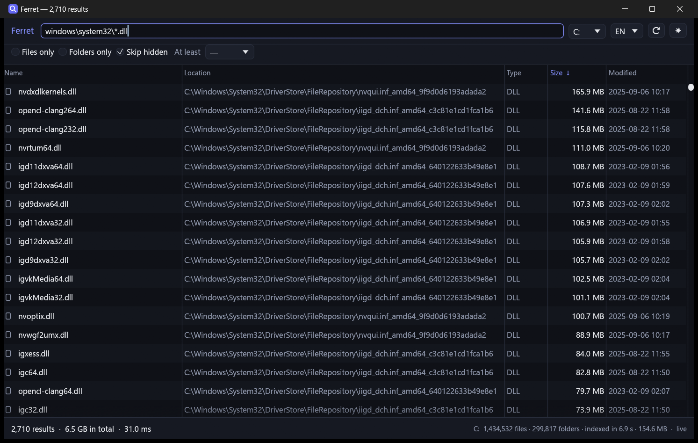

***English** · [Türkçe](README.tr.md)*

# Ferret

Instant file search for Windows. Type a letter, and a million files filter in
under ten milliseconds.

Windows Search crawls your directories and keeps a database that is often stale
and frequently slow. Ferret takes the other route: it reads the filesystem's own
table of contents — the NTFS **master file table** — directly off the raw
volume. One sequential pass, and the whole disk is in memory.

```
  files            : 1559745
  folders          : 297737
  scan             : 6.90 s
  search index     : 0.10 s
  memory           : 163.1 MB

  query                               results       time
  a                                   1112768    15.27 ms
  exe                                   16902     4.64 ms
  setup                                  3435     6.52 ms
  windows\system32\kernel                   1     6.97 ms
  zzqqxxnope                                0     3.69 ms

  path check       : 200/200 paths exist on disk

  live updates
      created and then found       : 25 / 25
      still indexed after deletion : 0

  RESULT: passed
```

That is real output from `--selftest` on a 1.8-million-record volume. It checks
that every reconstructed path actually exists on disk, and that files created and
deleted while it runs appear in and disappear from the index on their own.

## Two windows

Ferret has two front ends over the same engine. They do the same things — same
columns, same filters, same keyboard, same two languages, same live updates.

**`ferret-native`** is the one to use. One executable, drawn by [egui], with no
browser engine behind it: a quarter of the memory, one process instead of seven,
and nothing to install alongside it.

**`ferret-app`** draws the same application in a web view, through [Tauri]. It is
kept, not deprecated — it holds on to things the native window gives up, such as
paths you can select with the mouse, the whole system font stack, and a window
screen readers understand for free.

Everything below the window is shared, down to the change-journal rules, so
neither can drift from the other. The measurements, and the full list of
differences, are in [docs/TWO-WINDOWS.md](docs/TWO-WINDOWS.md).

[egui]: https://github.com/emilk/egui
[Tauri]: https://tauri.app

## Screenshots



A path query with a wildcard in it. 2,710 matches out of 1.4 million files,
sorted by size, in 31 ms — and the status bar adds them up to 6.5 GB, which is
usually the question behind a search like that one.

## What it does

- **Indexes a whole NTFS volume in seconds** by parsing `$MFT` rather than
  walking directories.
- **Filters as you type.** Every query is a single linear pass over a prepared
  lowercase arena, split across all cores.
- **Searches paths too.** Type `belgeler\rapor` and only that folder's matches
  come back — without ever materialising a million path strings.
- **Sorts and filters** by name, size, date, kind, and hidden/system attributes.
- **Stays current.** Ferret tails the NTFS change journal, so files created,
  renamed or deleted while it is open show up within about a second — no
  re-scan.
- **Adds up what it found.** The status bar carries the combined size of the
  matches, which is the question behind most size-filtered searches.
- **Opens what you find**: double-click, Enter, reveal in Explorer, copy path,
  or narrow the search to the folder a result sits in.
- **Speaks English or Turkish**, switched from the toolbar and remembered. Only
  the interface changes: file names, paths and dates come from the disk exactly
  as the filesystem has them.
- **Reads only.** Ferret opens volumes for reading and never writes a byte back.

## Requirements

- Windows 10 or 11
- An NTFS volume
- Administrator rights — raw volume access is privileged. Ferret starts without
  them and offers to restart elevated at the moment it needs to index.

## Releases

Tagging is the whole process. GitHub Actions runs the tests, builds everything
and publishes `Ferret.exe`, the installer and the command line as downloads.

```powershell
git tag v0.1.0
git push --tags
```

## Running it

```powershell
cargo run --release -p ferret-native   # the window
cargo run --release -p ferret-app      # the same thing, drawn by a web view
```

The executables land in `target/release/`: `ferret.exe` is the application,
`ferret-app.exe` is the web-view build, and `ferret-cli.exe` is the harness
below.

The development harness for the engine, which is where the numbers above come
from:

```powershell
cargo run --release -p ferret-cli -- scan  C     # index and summarise
cargo run --release -p ferret-cli -- find  C rapor
cargo run --release -p ferret-cli -- bench C     # query timings
```

And the end-to-end smoke test:

```powershell
cargo run --release -p ferret-native -- --selftest
```

Both binaries offer it, and both run the same checks.

## Keyboard

| Key | Action |
| --- | --- |
| `Ctrl+F` | Focus the search box |
| `↑` `↓` `PgUp` `PgDn` `Home` `End` | Move through results |
| `Enter` | Open the selected item |
| `Ctrl+C` | Copy its full path |
| `F5` | Re-index the current drive |
| `Esc` | Clear the query |

## How it works

`$MFT` is a table with one ~1 KB record per file. Each record holds the file's
name, its parent directory's record number, its size and its timestamps. Reading
that table start to finish gives you the entire filesystem without asking the
directory tree a single question.

Getting it right takes more than reading bytes in order:

- **Fixups.** NTFS replaces the last two bytes of every sector in a record with
  a check value and parks the real bytes in the header. Skip the reversal and
  every 512th byte pair is wrong; check it, and you also detect records that were
  torn mid-write.
- **8.3 aliases.** Most files carry two names, the real one and a legacy
  `PROGRA~1` alias. Indexing the alias makes results look like garbage.
- **Recycled record numbers.** A child's record can sit *below* its parent's, so
  no single forward pass can decide which entries are reachable. Reachability is
  settled after the scan, which also drops NTFS's own nested metafiles.
- **Search cost.** Lowercasing names per keystroke costs ~100 ms per query on a
  large volume. Lowercasing once into one contiguous arena — and searching that
  in parallel — costs 3–12 ms.
- **Stale snapshots.** The change journal names the record that changed, but
  re-reading that record from the raw volume returns stale bytes: raw reads
  bypass the filesystem cache, so a file created a second ago is still blank on
  the platter. The journal entry's own name, parent and attributes are the
  correct source.

There is a fuller walkthrough in [docs/ARCHITECTURE.md](docs/ARCHITECTURE.md).

## Layout

```
crates/ferret-core/     NTFS reader, index and search engine (no Windows API deps)
crates/ferret-shell/    Indexes, queries, row formatting, change-journal watcher
crates/ferret-native/   The window: egui, one executable
crates/ferret-app/      The alternative window: Tauri and a web view
ui/                       its front end: HTML, CSS, JavaScript — no framework
crates/ferret-cli/      Development harness: scan, find, bench
scripts/                Icon generator
```

## Status

Working and measured on real volumes. Known limits:

- NTFS only. FAT32 and exFAT volumes are listed but cannot be indexed.
- Live updates need the volume's USN journal to be enabled, which it is by
  default on the system drive. Without it, Ferret keeps its snapshot until `F5`.
- Renaming a file appends its new name to the name arena and leaves the old
  bytes behind; a long session with heavy churn slowly grows memory until the
  next full scan.
- Sorting is skipped past 200 000 results: at that size the list is not
  something anyone reads in order, and the sort would cost a visible pause.
- The native window draws in Segoe UI, which covers Latin, Greek and Cyrillic.
  File names in Chinese, Japanese, Korean or Arabic fall back to egui's own font
  and can show empty boxes; the web-view window has the whole system font stack
  and does not.

## Licence

MIT. See [LICENSE](LICENSE).
